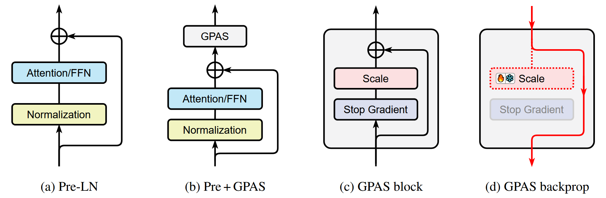

# GPAS

This repository provides reproduction code for our paper [GPAS: Accelerating Convergence of LLM Pretraining via Gradient-Preserving Activation Scaling](https://www.arxiv.org/abs/2506.22049).




## Setup
You can run the following commands to prepare the conda environment:
```bash
conda create -n gpas python=3.9 -y
conda activate gpas
pip install -r requirements.txt
```
Before running the training scripts, you might need to login to HuggingFace and WandB using these commands:
```bash
huggingface-cli login
wandb login
```
The first enables streaming the C4 dataset during training, and the second is used for tracking training statistics.
For longer runs such as the 1B and 7B parameter experiments, we recommend downloading the C4 dataset locally to avoid streaming error.


## Reproduce Pretraining Results
To reproduce the results from our paper, run the training scripts located in `scripts/`.
For example, to run the 71M experiments:
```bash
sh scripts/run_71m.sh <NORM_TYPE> <POST_NUM>
```
The table below lists different architectures and their respective arguments. 

| Architecture       | `<NORM_TYPE>`              | `<POST_NUM>`                    |
|--------------------|---------------------------|---------------------------------|
| Post-LN            | `post`                    | -                               |
| DeepNorm           | `deeppost`                | -                               |
| Pre-LN             | `pre`                     | -                               |
| Sandwich-LN        | `sandwich`                | -                               |
| Mix-LN             | `post_pre`                | `num_hidden_layers // 4`        |
| LNS                | `lns`                     | -                               |
| DeepNorm + GPAS    | `deeppost_gpas`           | -                               |
| Pre + GPAS         | `pre_gpas`                | -                               |
| Sandwich + GPAS    | `sandwich_gpas`           | -                               |
| Mix + GPAS         | `post_pre_gpas`           | `num_hidden_layers // 4`        |
| LNS + GPAS         | `lns_gpas`                | -                               |

`<NORM_TYPE>` refers to the normalization scheme. `<POST_NUM>` is only applicable for Mix-LN and Mix + GPAS, which stands for the number of Post-LN layers. This value is recommended to set at 25% of total number of layers. You can find the number of layers for different model sizes in the configuration files under `configs/`. For instance, the 71M model has 12 layers in total, so we use 3 Post-LN layers for Mix-LN:
```bash
sh scripts/run_71m.sh post_pre 3
```
For other architectures, simply ignore this argument:
```bash
sh scripts/run_71m.sh pre_gpas
```

### Gradient clipping
For certain experiments, we clip the gradient of GPAS gates to stabilize training. To reproduce the result for Sandwich + GPAS at 1B parameters, you need to modify the `scripts/run_1b.sh` by adding this argument:
```bash
--clip_gate_grad 0.01
```

For the pretraining of Pre-LN and Pre + GPAS at 7B parameters, we use gradient clipping of 0.01 for GPAS gates, and 1.0 for all other parameters. These arguments are already present in `scripts/run_7b.sh`.

### Resume training
Our training script supports checkpointing and resuming, which is useful for longer runs. You may use `--save_every` and `--continue_from` when necessary.
To resume training from a previously saved checkpoint, you can add the following arguments to the training script:
```bash
--continue_from /path/to/checkpoint \
--new_wandb_on_resume
```

The argument `--new_wandb_on_resume` is optional. By default, we resume the training process as well as the WandB run. Using a new WandB run for the resumed training can be helpful for ensuring consistent dataloader states.


## Reproduce SFT Results
Please refer to [Owlore](https://github.com/pixeli99/OWS) for instructions on how to use LISA for finetuning on the Commonsense170K dataset, as well as the evaluation on MMLU and Commonsense Reasoning benchmarks.

We finetune the pretrained 1B models for 4 epochs using the following configurations:
```bash
lisa_activated_layers=4
MODE=uniform
data_dir=merge
seed=42
interval=3
learning_rate=3e-4
```


## Acknowledgement
This repository is built upon [Galore](https://github.com/jiaweizzhao/GaLore) and [Mix-LN](https://github.com/pixeli99/MixLN). Thanks for their great work!

## Citation
If you find this work useful, please consider citing our paper:
```
@article{chen2025gpas,
      title={GPAS: Accelerating Convergence of LLM Pretraining via Gradient-Preserving Activation Scaling}, 
      author={Tianhao Chen and Xin Xu and Zijing Liu and Pengxiang Li and Xinyuan Song and Ajay Kumar Jaiswal and Fan Zhang and Jishan Hu and Yang Wang and Hao Chen and Shizhe Diao and Shiwei Liu and Yu Li and Lu Yin and Can Yang},
      journal={arXiv preprint arXiv:2506.22049},
      year={2025}
}
```